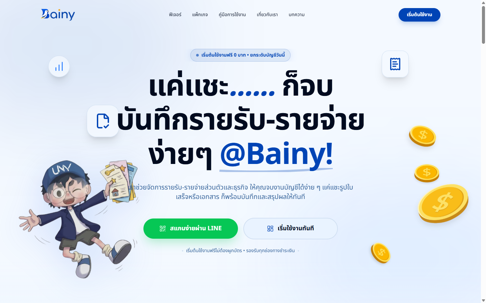
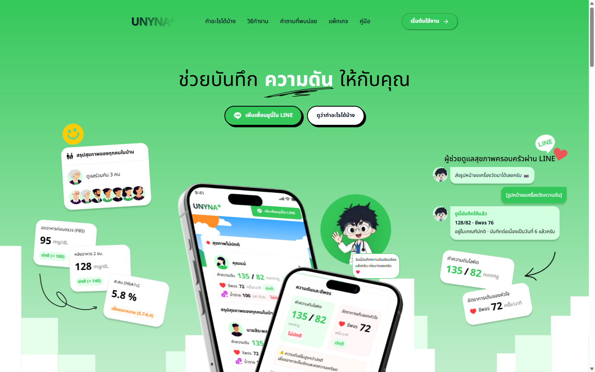
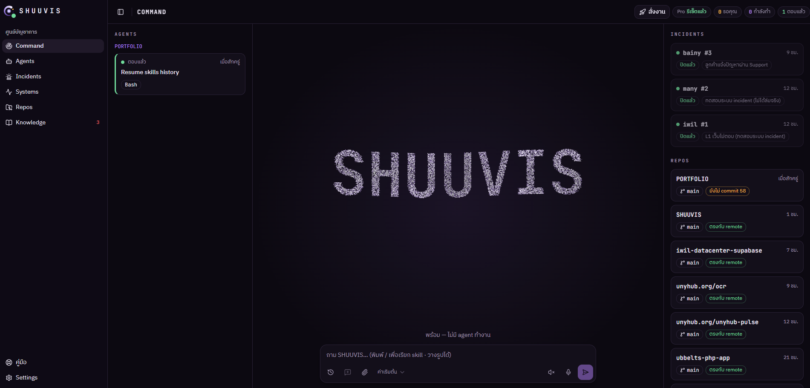
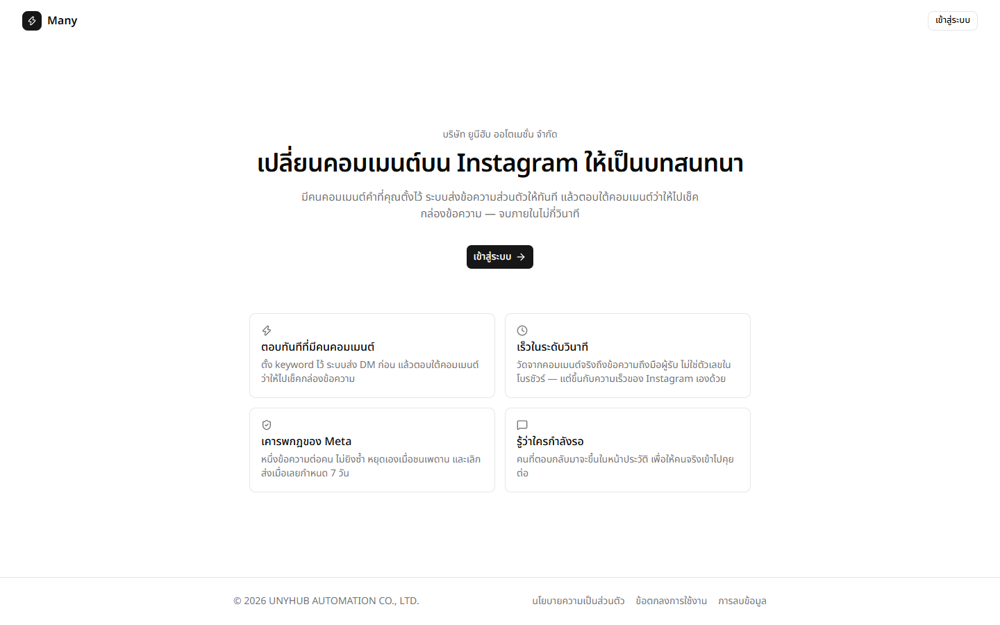
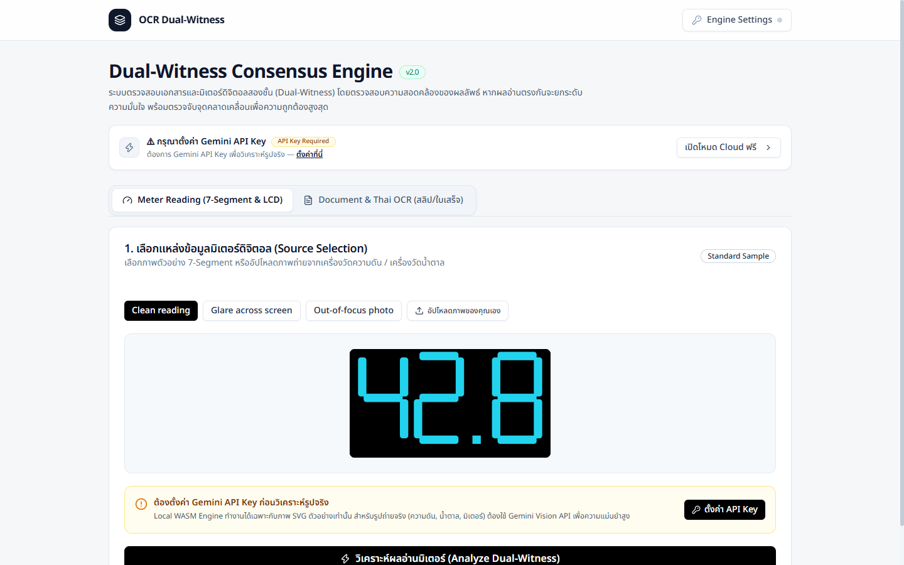
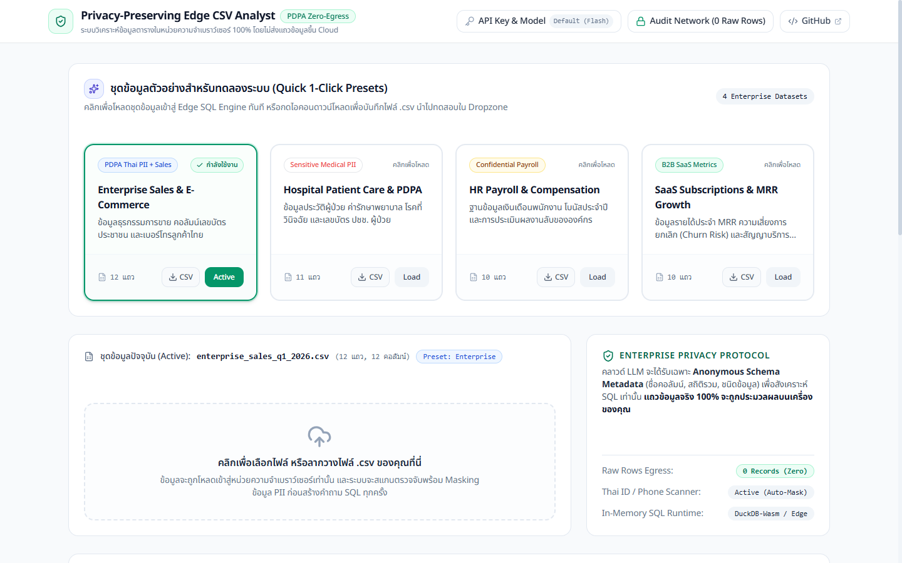
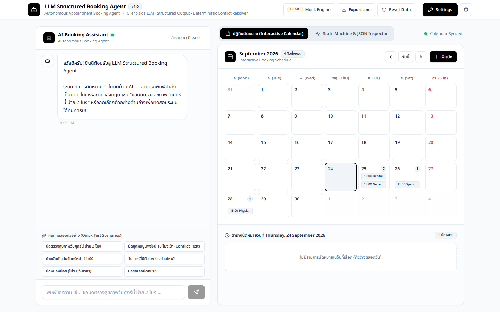

<picture>
  <source media="(max-width: 600px)" srcset="assets/header-mobile.svg" />
  
</picture>

  
  
  
  

<picture>
  <source media="(max-width: 600px)" srcset="assets/stats-mobile.svg" />
  
</picture>

## 👋 About

- **Full-stack product delivery.** I co-founded [UNYHUB Automation](https://unyhub.org) and ship LINE-native SaaS end to end: requirements, architecture, UAT, deployment and monitoring.
- **Reliable AI in production.** Structured LLM outputs (strict JSON Schema), dual-model vision with confidence gating, and conversational agents. They are live with paying customers (Bainy) and 900+ LINE OA followers (Unyna).
- **Claude Code is my daily build tool.** I write the spec, review the diff and test every change before it ships.
- **Languages:** Thai (native) and English (professional working).

 

## ⚡ Production systems

Built at UNYHUB. The code is closed source, in private company repositories. The live systems are linked.

### 💳 [Bainy](https://bainy.unyhub.org) — LINE-native expense & accounting SaaS

- **Launched to paying customers.** A multi-tenant SaaS inside LINE (LIFF) with Beam payment subscriptions. Every query is scoped to its organization to block cross-tenant access.
- **Automated receipt bookkeeping.** A LINE webhook OCR pipeline (Sharp preprocessing + Gemini Flash, strict JSON Schema) extracts amounts, dates and 7% VAT.
- **Bank reconciliation & Mini-CFO agent.** Parsers for SCB (PDF/CSV) and KBank (CSV) statements, plus a chat advisor for sales and cash-flow questions.
- **Owned a production outage end to end.** I traced a 70k-row import that exhausted Postgres disk I/O (write amplification, swap, autovacuum) and wrote the postmortem.

`Next.js` `TypeScript` `Prisma` `PostgreSQL / Supabase` `Gemini Flash` `Sharp` `LINE Messaging API` `Beam`

### 🩺 [Unyna](https://unyna.unyhub.org) — LINE health assistant for families

- **In production with 900+ LINE OA followers.** People log blood pressure by chat or by photo and get appointment reminders.
- **Dual-witness vision for 7-segment displays.** OpenAI Vision reads first (temperature 0, structured output). Google Vision is called only when a reading looks untrustworthy. If the two disagree, the user confirms — nothing is guessed.

`Next.js` `TypeScript` `Supabase` `OpenAI Vision` `Google Cloud Vision` `LINE Messaging API` `Sentry`

### 🛡️ SHUUVIS — my command center for AI agents and production

- **A live view of every Claude Code session.** Hooks and transcripts stream over SSE, with a push notification when an agent needs input.
- **Incident response with a human gate.** A Cloudflare Worker health-checks every system each minute and opens a Discord incident. An agent drafts the fix as a PR, and nothing merges without my approval.
- **Self-hosted observability.** Uptime SLA and p50/p95 latency are computed from its own outage log.
- **Local-first.** Ollama runs the LLMs and F5-TTS runs Thai voice on my own GPU, reachable only through Tailscale.

`Node.js` `TypeScript` `Cloudflare Workers` `SQLite` `Discord.js` `Ollama` `Tailscale`

### ⚡ [Many](https://many.unyhub.org) — Instagram comment-to-DM automation, used in-house

- **Rule-based on purpose.** There is no model in the decision path, so every keyword trigger can be audited. It replaced replying to comments by hand.
- **Metric snapshots.** An append-only pipeline stores metrics from the Meta Graph API for content analysis.

`Next.js` `TypeScript` `Prisma` `Supabase` `Meta Graph API`

 

## 🧭 How I build with LLMs

<picture>
  <source media="(max-width: 600px)" srcset="assets/pipeline-mobile.svg" />
  
</picture>

> *"Deterministic when possible, probabilistic only when necessary."*

- 🧮 **The model classifies; code does the arithmetic.** Every number is computed in code and checked by a Zod schema before it is written.
- 👁️ **A second reader that can object.** When a wrong answer is costly, a second read must agree — otherwise the user decides.
- 🚦 **A human gate before production.** Agents may draft the fix, but nothing merges or deploys without approval.

 

## 🔬 Open-source demos

Small modules lifted out of the production problems above and rebuilt in public: strict TypeScript, running in the browser, bring your own key.

  
  
  

1. **[ocr-dual-witness-pipeline](https://github.com/Shuumei/ocr-dual-witness-pipeline)** · [live demo ↗](https://ocr-dual-witness-pipeline.vercel.app) 
   The public version of Unyna's 7-segment reader. Two independent reads must agree; otherwise confidence gating asks the user instead of guessing.
2. **[edge-privacy-csv-analyst](https://github.com/Shuumei/edge-privacy-csv-analyst)** · [live demo ↗](https://edge-privacy-csv-analyst.vercel.app) 
   Ask a spreadsheet questions in plain language. The work runs in browser Web Workers, and only summarized metadata reaches the LLM.
3. **[llm-structured-booking-agent](https://github.com/Shuumei/llm-structured-booking-agent)** · [live demo ↗](https://llm-structured-booking-agent.vercel.app) 
   Strict JSON Schema extraction drives a deterministic state machine with interval-overlap checks, so double-booking can't happen. Covered by 19 Vitest unit tests.

Also public: [bbs-discord-bot](https://github.com/Shuumei/bbs-discord-bot), a Discord guild companion bot, and [tradingview-custom-indicator](https://github.com/Shuumei/tradingview-custom-indicator), a Smart Money Concepts indicator in Pine Script & MQL5.

 

## 💼 Experience

**Co-Founder & Founding Engineer** · UNYHUB Automation Co., Ltd. &nbsp;Feb 2026 – Present · Remote
- I own product strategy and engineering end to end for the company's products and client work: Bainy, Unyna, Many and SHUUVIS (above).
- **i-study:** took a hand-drawn sketch to a working prototype in one night with Claude Code, then delivered a production student-records CMS within a month.
- **ubbelts:** built a Laravel/Filament corporate site and lead-management CMS for an industrial manufacturer, with a 34-case end-to-end test suite.

**Contract Developer** · Freelance, referred via the UNYHUB network &nbsp;Aug 2026
- Root-caused and fixed a production blocker for a government rural hospital: its LINE LIFF child-development tracker couldn't save forms inside LINE's in-app browser. I fixed it without rewriting the client's system and verified the fix on real phones.

**Frontend Developer** (internship → full-time) · TNT Media & Network Co., Ltd. &nbsp;May 2025 – Jan 2026
- Built infrastructure health monitoring for the core product: Prometheus metrics, a custom API and dashboard, centralized logs and health checks for LLM services.
- Built a marketing-analytics dashboard (GA4, Search Console, Google Ads) and Looker Studio BI dashboards fed by an SQL ETL pipeline.
- Built Next.js/React features for client web projects, including Bangkok Airways.

 

## 🎓 Education & leadership

**Bachelor of Information Science — First-Class Honours (GPA 3.81)** · Khon Kaen University &nbsp;2022 – 2026
- 🏆 KKU President's Outstanding Student Activity Award · Faculty Renown Award (Humanities & Social Sciences) · AUCC 2025 Academic Research Award & presenter
- 🧑‍🤝‍🧑 Class President, iStudent 48 · Project Manager & Design Lead, 2nd iSchool Tech Camp
- 📜 New Breed Graduate Program (KKU) · Data & AI Competency (NIDA & Thai MOOC)

 

## 💻 Toolkit

Where I used each tool is tagged in the <a href="https://metee.vercel.app/#stack">stack section of my portfolio</a>.

   
  

  
  
  
  
  
  
   
  
  
  
  
  
  

 

## 🤝 Let's talk about the next build

I'm open to **AI-Assisted Full-Stack Developer** and **Applied AI / LLM Engineering** roles on teams that ship AI features to real users. I'm available immediately and based in Bangkok.

  
  

